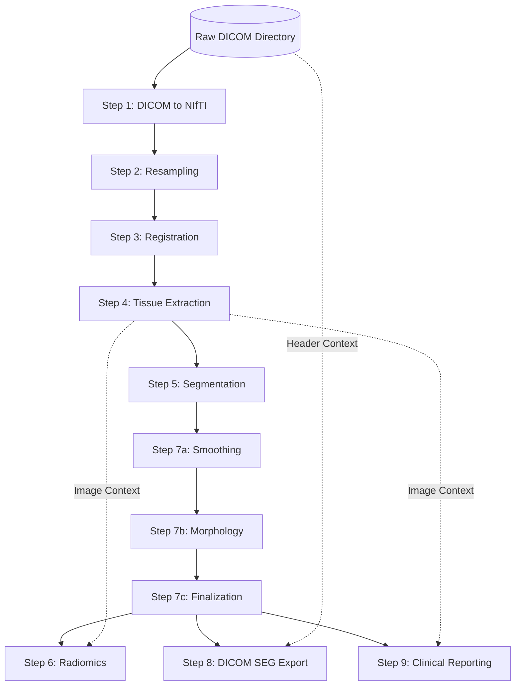

# Medical Processing Pipeline: Execution DAG

This document defines the Directed Acyclic Graph (DAG) for the Medical Processing Pipeline. It dictates the execution workflow, assuming a Local Coordinator is orchestrating the daemon workers. The Coordinator is responsible for mapping the outputs of completed stages into the read-only inputs of subsequent stages.

## 1. High-Level DAG Structure

The workflow is strictly sequential until the post-processing is finalized, at which point the pipeline branches into three parallel reporting/export stages.

---

## 2. Global Execution Rules for the Coordinator
*   **Sandbox Isolation:** Every stage executes in a clean sandbox. The Coordinator must explicitly mount the required input files into the worker's `--input-dir` and harvest the generated artifacts from `--output-dir`.
*   **Daemon Invocation:** The Coordinator feeds a JSON payload containing `input_dir`, `output_dir`, `job_id`, and `config` to the worker's `stdin`.
*   **Fault Tolerance:** If any node in the sequential path (Steps 1 through 7c) returns a `Worker Failed` state, the entire DAG execution must be aborted.

---

## 3. Node-by-Node Requirements

### Initial Pipeline Input
*   **Payload:** Directory containing raw `.dcm` files.

### Step 1: DICOM to NIfTI Conversion
*   **Dependency:** Initial Input
*   **Requires:** Raw DICOM directory mounted to `/input`.
*   **Config Arguments:** `target_series_description` (optional string filter).
*   **Produces:** `image.nii.gz` (Primary anatomical volume).

### Step 2: Resampling
*   **Dependency:** Step 1
*   **Requires:** `image.nii.gz`
*   **Config Arguments:** `target_resolution` (e.g., `[1.0, 1.0, 1.0]`).
*   **Produces:** `resampled_image.nii.gz`

### Step 3: Image Registration
*   **Dependency:** Step 2
*   **Requires:** `resampled_image.nii.gz`, plus a static Reference Atlas volume mounted.
*   **Config Arguments:** `registration_type` (e.g., `Rigid` or `Affine`).
*   **Produces:** `registered_image.nii.gz` and `transform_matrix.tfm`.

### Step 4: Tissue Extraction (Skull Stripping)
*   **Dependency:** Step 3
*   **Requires:** `registered_image.nii.gz`
*   **Produces:** `extracted_image.nii.gz` (Image containing only target tissue) and `tissue_mask.nii.gz` (Boolean mask of extraction).

### Step 5: Primary Segmentation
*   **Dependency:** Step 4
*   **Requires:** `extracted_image.nii.gz`
*   **Config Arguments:** `model_weights` (optional path to AI weights).
*   **Produces:** `raw_segmentation.nii.gz` (Unfiltered label map).

### Step 7a: Label Map Smoothing
*   **Dependency:** Step 5
*   **Requires:** `raw_segmentation.nii.gz`
*   **Produces:** `smoothed_segmentation.nii.gz`

### Step 7b: Morphological Operations
*   **Dependency:** Step 7a
*   **Requires:** `smoothed_segmentation.nii.gz`
*   **Config Arguments:** `kernel_radius` (integer).
*   **Produces:** `morph_segmentation.nii.gz`

### Step 7c: Finalization (Thresholding)
*   **Dependency:** Step 7b
*   **Requires:** `morph_segmentation.nii.gz`
*   **Produces:** `final_segmentation.nii.gz` (The definitive, clinically-ready label map).

---
*(Note: The following three stages can be executed simultaneously by the Coordinator as parallel tasks).*

### Step 6: Radiomics Feature Extraction
*   **Dependencies:** Step 4 & Step 7c
*   **Requires:** `extracted_image.nii.gz` (for intensity data) and `final_segmentation.nii.gz` (for spatial boundaries).
*   **Config Arguments:** `feature_classes` (e.g., `["glcm", "shape"]`).
*   **Produces:** `radiomics.json` (Machine-readable high-order math features).

### Step 8: DICOM SEG Export
*   **Dependencies:** Initial Input & Step 7c
*   **Requires:** The original Raw DICOM directory (to extract legal Patient/Study headers) and `final_segmentation.nii.gz`.
*   **Produces:** `segmentation.dcm` (PACS-compatible DICOM Object).

### Step 9: Clinical Measurement & Reporting
*   **Dependencies:** Step 4 & Step 7c
*   **Requires:** `extracted_image.nii.gz` and `final_segmentation.nii.gz`.
*   **Produces:** 
    1. `clinical_report.md` (Human-readable summary).
    2. `measurements.json` (Structured numerical values).
    3. `processing_report.json` (Engineering metadata and integrity checks).
